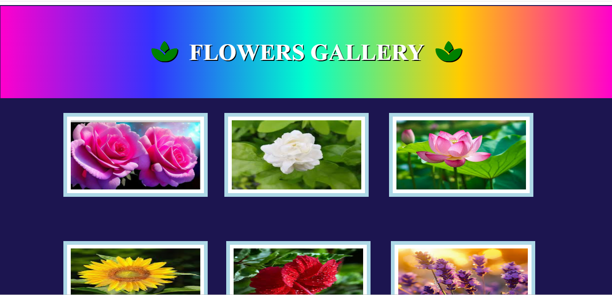
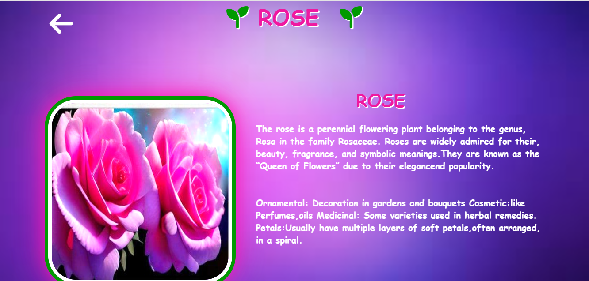
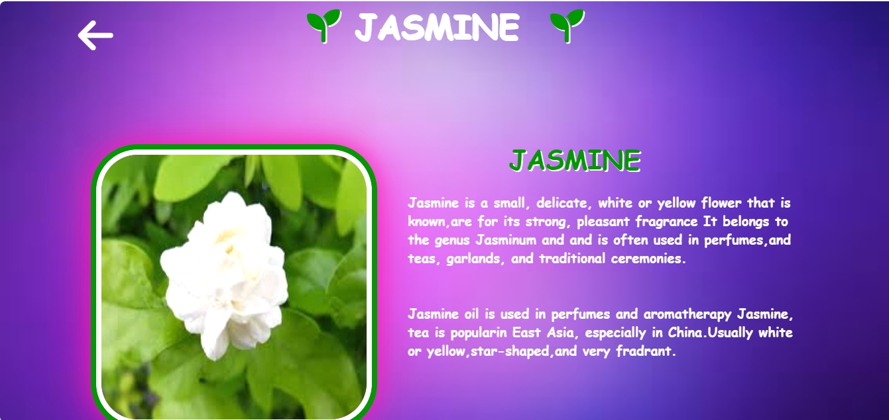
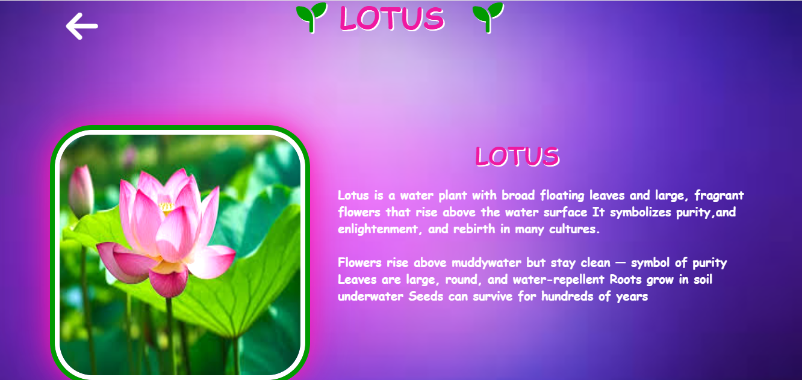
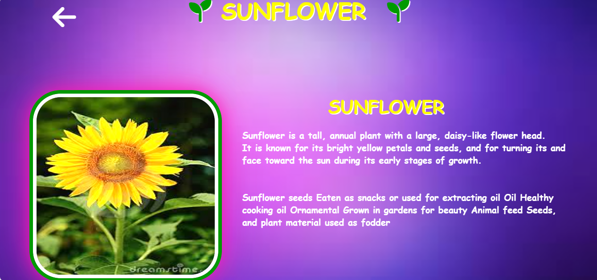
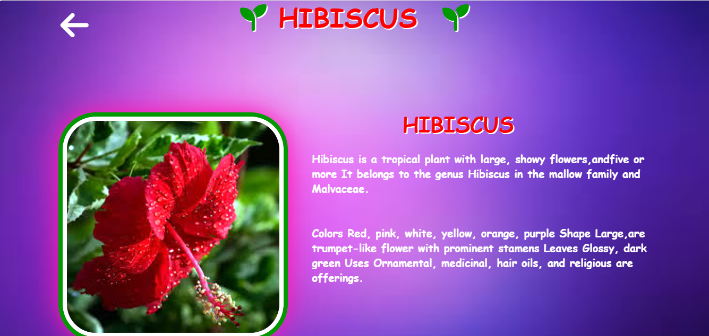
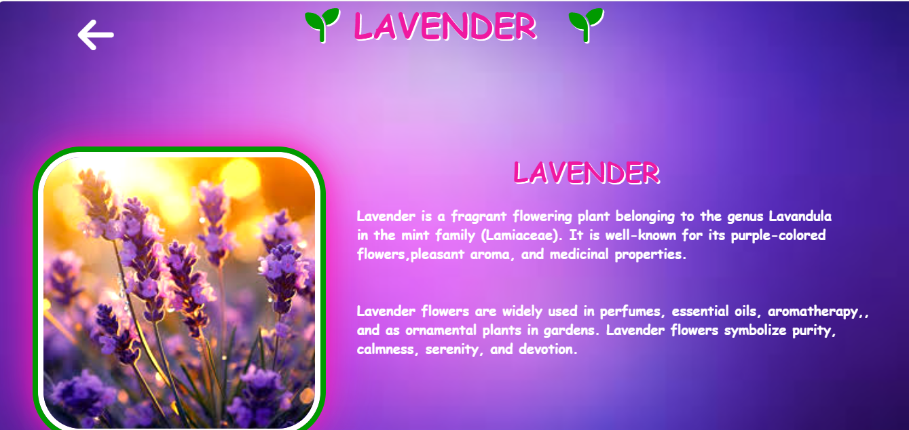
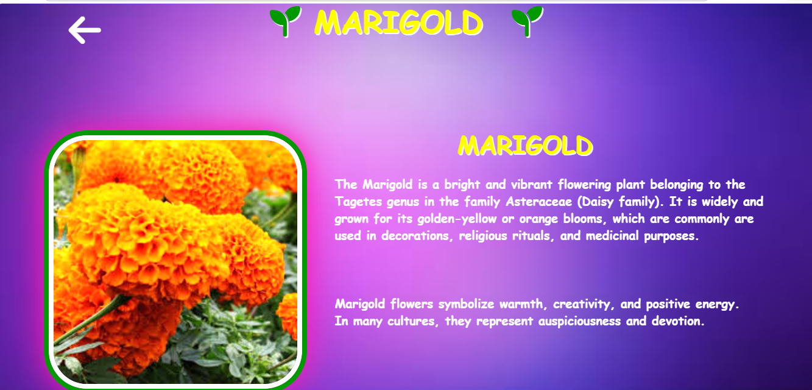
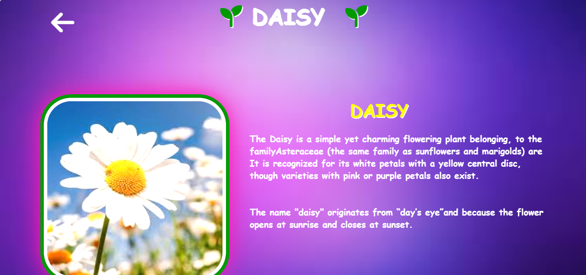
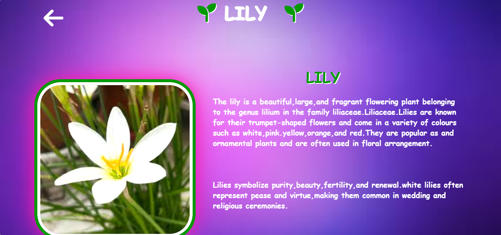

# 🌸 Flower Gallery Website

A beautiful **Flower Gallery Website** built using **HTML**, **CSS**, and **Font Awesome** icons. The gallery displays 9 different flowers, each linking to a dedicated detail page with description and image.

# 📸 Project Screenshots

## 🏠 Main Gallery Page



---

## 🌹 Rose Page



---

## 🌼 Jasmine Page



---

## 🪷 Lotus Page



---

## 🌻 Sunflower Page



---

## 🌺 Hibiscus Page



---

## 💜 Lavender Page



---

## 🟠 Marigold Page



---

## 🌸 Daisy Page



---

## 🌷 Lily Page



---

## 📁 Project Structure

```


## 📁 Project Structure

```
flowergallery/
│
├── index.html
│
├── pages/
│   ├── rose1.html
│   ├── jasmine1.html
│   ├── lotes1.html
│   ├── sunflower1.html
│   ├── hibiscus1.html
│   ├── lavender1.html
│   ├── marigold1.html
│   ├── daisy1.html
│   └── lily1.html
│
└── assets/
├── css/
│ ├── style.css
│ └── styleo.css
│
├── img/
│ ├── 101.png
│ ├── img2.png
│ ├── imga.png
│ ├── img4.png
│ ├── img5.png
│ ├── img6.png
│ ├── mari.png
│ ├── daisy.png
│ └── lily1.png
│
└── screenshots/
├── home.png
├── rose.png
├── jasmine.png
├── lotus.png
├── sunflower.png
├── hibiscus.png
├── lavender.png
├── marigold.png
├── daisy.png
└── lily.png
```

## 🌺 Flowers in the Gallery

| Flower | Page |
|--------|------|
| 🌹 Rose | `pages/rose1.html` |
| 🌼 Jasmine | `pages/jasmine1.html` |
| 🪷 Lotus | `pages/lotes1.html` |
| 🌻 Sunflower | `pages/sunflower1.html` |
| 🌺 Hibiscus | `pages/hibiscus1.html` |
| 💜 Lavender | `pages/lavender1.html` |
| 🟠 Marigold | `pages/marigold1.html` |
| 🌸 Daisy | `pages/daisy1.html` |
| 🌷 Lily | `pages/lily1.html` |

## 🚀 Features

- Image gallery with 9 flower cards
- Click on any flower → opens detail page with image and description
- Back arrow to return to main gallery
- Social media icons in footer (Facebook, Twitter, Instagram, LinkedIn, WhatsApp, YouTube)
- Font Awesome 6.4.0 icons
- Two CSS files — one for gallery, one for detail pages

## 🛠️ Technologies Used

- HTML5
- CS
- Font Awesome 6.4.0 (CDN)

## ⚙️ Setup & Usage

1. **Clone the repository**
   ```bash
   git clone https://github.com/Monisha71326/flowergallery.git
   ```

2. **Navigate to the project folder**
   ```bash
   cd flowergallery
   ```

3. **Open in browser**
   ```bash
   open index.html
   ```
   or double-click `index.html`

> ⚠️ Make sure `assets/img/` folder has all images for the gallery to display correctly.

## 🔗 Navigation Flow

```
index.html (Main Gallery)
    ├── pages/rose1.html
    ├── pages/jasmine1.html
    ├── pages/lotes1.html
    ├── pages/sunflower1.html
    ├── pages/hibiscus1.html
    ├── pages/lavender1.html
    ├── pages/marigold1.html
    ├── pages/daisy1.html
    └── pages/lily1.html
         ↑
    (Back arrow → index.html)
```

## 🚀 GitHub Push Commands

```bash
git init
git add .
git commit -m "Initial commit - Flower Gallery Website"
git branch -M main
git remote add origin https://github.com/Monisha71326/flowergallery.git
git push -u origin main
```

## 📄 License

This project is open source and available under the [MIT License](LICENSE).


